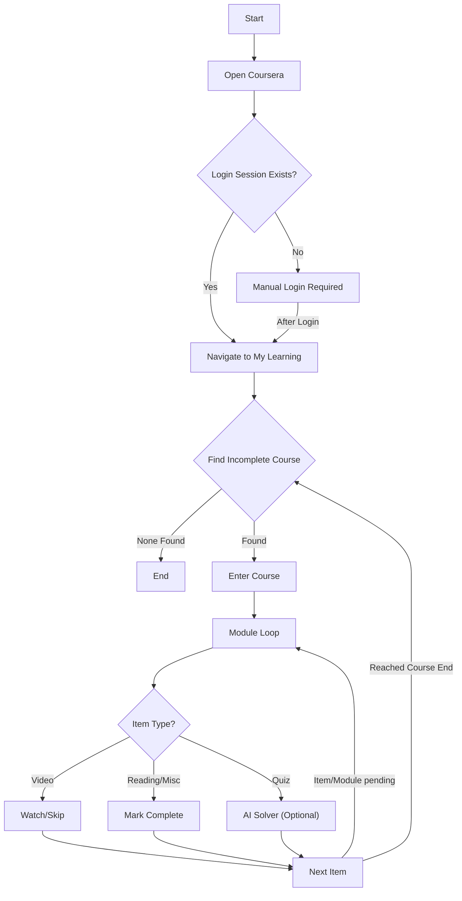

> 📦 This repository is archived.  
> It is kept as a personal learning and experimentation project and is no longer actively developed.

# Coursera Automation — Personal Selenium Learning Project


> [!WARNING]
> **Important Disclaimer**
>
> This is a **personal, educational automation project** created for learning and experimentation with Selenium, browser automation, and UI-driven workflows.
>
> * This project is **not affiliated with Coursera**.
> * It is **not intended for commercial use, abuse, or large-scale automation**.
> * It was built in a controlled environment where access to course content was legitimately provided (e.g., institutional/college access).
>
> **Use responsibly and in accordance with all applicable terms of service.**

<br>

## 📖 Motivation & Context

This project started as a **hands-on learning exercise**.

While experimenting with Selenium, I wanted a realistic, stateful, non-trivial website to test:
* Persistent sessions
* Complex navigation flows
* Dynamic DOM updates
* Retry logic and resilience
* Long-running browser automation

Having **legitimate institutional access to Coursera via my college**, it became a practical sandbox to:
* Explore Selenium deeply.
* Understand how real production UIs behave.
* Build something end-to-end instead of toy scripts.

AI integration was later added **purely as an experiment** and documented transparently.

<br>

## 🎯 What This Project Is (and Is Not)

### ✅ What it *is*
* A **learning-focused Selenium automation system**
* A **personal showcase project**
* A real-world example of:
    * Stateful browser automation
    * Modular Python scripting
    * Defensive UI handling
    * Optional AI-assisted workflows

### ❌ What it *is not*
* A polished product
* A guaranteed automation tool
* A bot framework
* A Coursera exploit
* Something meant to run unattended forever

<br>

## ⚙️ High-Level Overview

The automation:
1.  Opens Coursera using a **real Chromium browser**.
2.  Uses a **persistent Chrome profile**.
3.  Requires **manual login once**.
4.  Navigates through:
    * *My Learning*
    * In-progress courses
    * Modules and items
5.  Handles:
    * Videos
    * Mark-as-complete buttons
    * Optional / completed items
6.  Optionally:
    * Detects quizzes
    * Extracts questions
    * Uses AI APIs to propose answers
    * Submits attempts

The emphasis is on **realistic browser behavior**, not stealth or speed.

<br>

## 🏗️ Core Design Principles

1.  **Stateful over stateless**
    Uses a real browser profile instead of re-authenticating.
2.  **Resilient over perfect**
    Retry loops and fallbacks are preferred to brittle logic.
3.  **Readable over clever**
    Code is intentionally verbose and explicit.
4.  **Learning-first**
    This repo prioritizes understanding over optimization.

<br>

## 📂 Project Structure

```text
.
├── script.py          # Main entry point and orchestration
├── navigate.py        # Site navigation and course selection
├── course.py          # Course items, videos, completion logic
├── quiz.py            # Quiz detection + AI-assisted solving
├── misc.py            # Utilities (random delays, scrolling)
├── debug.py           # Login & session bootstrap helper
├── requirements.txt   # Python dependencies
├── pyproject.toml     # Project configuration
├── README.md          # Documentation
├── .gitignore         # Git ignore rules
├── chromium/          # (ignored) Portable Chromium binaries
│   ├── chrome.exe
│   └── chromedriver.exe
├── chrome-profile/    # (ignored) Persistent browser session
└── api.json           # (ignored) API keys (dummy or real)

```

<br>

## 💻 Target Environment

* **OS**: Windows 10 / 11
* **Python**: 3.9+
* **Browser**: Chromium / Chrome
* **Driver**: ChromeDriver (matching version)

> *Note: Linux/macOS are **not officially supported** in this repo, though the logic is portable if paths are adjusted.*

<br>

## 📦 Dependencies

Install Python dependencies using:

```powershell
pip install -r requirements.txt

```

**Key Libraries:**

* `selenium`
* `openai` *(optional, for AI experiments)*
* `google-generativeai` *(optional, for AI experiments)*

<br>

## 🌐 Browser Setup (Required)

This project expects a **portable Chromium setup** to ensure environment consistency.

**Directory structure:**

```text
chromium/
├── chrome.exe
└── chromedriver.exe

```

**PowerShell sanity checks:**

```powershell
Test-Path .\chromium\chrome.exe
Test-Path .\chromium\chromedriver.exe

```

> ⚠️ **Critical:** ChromeDriver version **must match** the Chromium version.

<br>

## 🔐 Persistent Login Model

This project **does not attempt to bypass authentication**.

**Flow:**

1. Browser opens normally.
2. You log in manually.
3. Session data is stored in `chrome-profile/`.
4. Future runs reuse the session cookie/profile.

This approach reduces flakiness, mimics real usage, and avoids repeated 2FA/login prompts.

<br>

## 🚀 First-Time Setup

### Step 1: Create virtual environment (recommended)

```powershell
python -m venv .venv
.venv\Scripts\activate

```

### Step 2: Install dependencies

```powershell
pip install -r requirements.txt

```

### Step 3: Initial login

```powershell
python debug.py

```

*Log in manually when the browser opens, then close the script.*

<br>

## ▶️ Running the Automation

```powershell
python script.py

```

The script will:

1. Navigate to *My Learning*.
2. Process incomplete courses.
3. Return to the dashboard.
4. Repeat until nothing remains.

<br>

## 🧠 Automation Flow

> *Note: If the diagram does not render, view this README on GitHub Desktop or github.com.*


<br>

## 🤖 AI-Assisted Quiz Handling (Optional)

AI integration exists **purely for experimentation**.

**Capabilities:**

* Extract quiz questions & options.
* Normalize question text.
* Query AI APIs.
* Fill radio / checkbox / text inputs.
* Submit attempts.

**Supported providers:**

* OpenAI
* Google Gemini

### API Configuration

Create `api.json` in the root directory:

```json
{
  "api_keys": [
    {
      "key": "YOUR_API_KEY",
      "service": "openai",
      "status": "working",
      "counter": 0
    }
  ]
}

```

* Multiple keys supported.
* Automatic failover logic.
* **Gitignored** by default for security.

<br>

## 🛠️ Testing & Diagnostics

**View directory structure:**

```powershell
tree /F

```

**Verify Python version:**

```powershell
python --version

```

**Check installed packages:**

```powershell
pip list

```

**Selenium sanity check (PowerShell One-Liner):**

```powershell
python -c "from selenium import webdriver; print('Selenium import OK')"

```

<br>

## ⚠️ Known Limitations & Philosophy

**Error Handling:**

* Retries > crashes.
* Logs > silence.
* Expect `StaleElementReferenceException` and DOM mutations.

**Limitations:**

* Highly dependent on Coursera’s specific UI classes.
* Global state is used intentionally.
* No concurrency support (Single Threaded).
* **Breakage is expected over time.**

<br>

## ⚖️ Ethics & License

**MIT License**
Provided **as-is**, without warranty.

**Final Note:**
If you clone or fork this project, expect to modify CSS selectors. Treat this as a **learning artifact**, not a finished product.

Happy hacking.

<br>

> 📦 **Repository archived**  
> This project is preserved as a personal learning reference and is no longer under active development.
